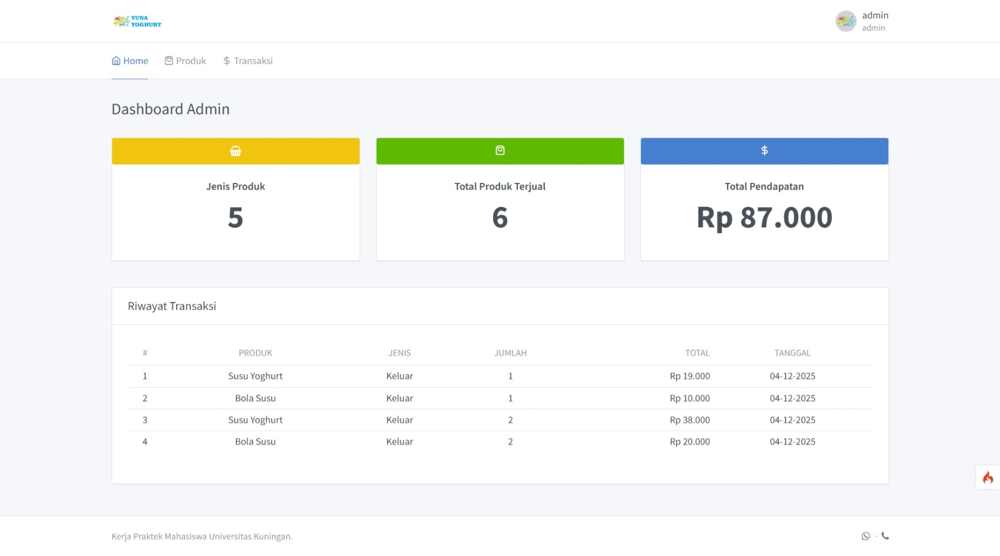
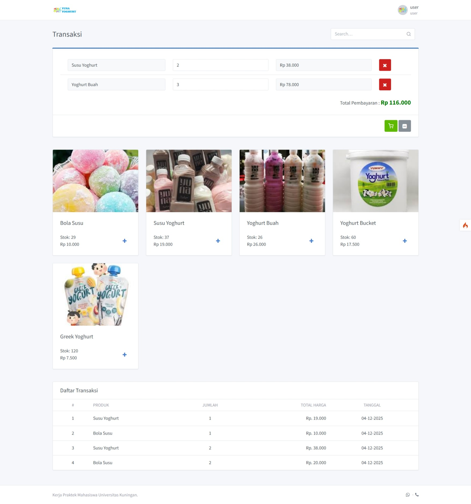

# 🧾 Aplikasi POS Berbasis Web

Aplikasi **Point of Sale (POS)** berbasis web yang dibangun menggunakan **CodeIgniter 4 Framework**.  
Aplikasi ini dirancang untuk membantu pengelolaan transaksi penjualan, data produk, dan laporan secara efisien.

---

## 📌 Deskripsi
Aplikasi POS ini memungkinkan pengguna untuk mengelola transaksi penjualan secara cepat dan akurat dengan sistem berbasis web yang mudah digunakan.

---

## 🚀 Fitur Utama
- Manajemen produk
- Transaksi penjualan
- Perhitungan otomatis total pembayaran
- Manajemen pengguna
- Laporan penjualan
- Autentikasi login
- Hak Akses pemilik sebagai admin dan kasir sebagai user

---

## 🛠️ Teknologi yang Digunakan
- PHP 8.1+
- CodeIgniter 4
- MySQL
- Bootstrap

---

## 📷 Tampilan Aplikasi

### 🔐 Halaman Login


### 📊 Dashboard


### 🧾 Kasir



---

## ⚙️ Instalasi

### 1️⃣ Clone Repository
```bash
git clone https://github.com/Farwezra9/Aplikasi-POS-Berbasis-Web.git
